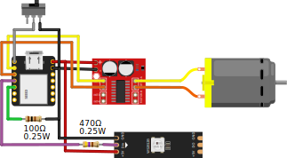

# Looping Louie

The children's game Looping Louie gets boring fast, especially when the same person keeps winning all the time. To spice things up a bit, I added a microcontroller and a H-bridge to drive the motor. With the code in this repository, Louie can not only randomly change speed, but also perform some wicked flight manoeuvres. Nobody is safe any more, even the most skilled player has no chance sometimes.

## Modification

> Do the modification at your own risk. I am not responsible for warranty loss or potential damage to the game or other electronic components. Basic electronic knowledge is required.

After the modification, the game can no longer operate on batteries, but gets power via USB. The existing red lever still starts and stops the motor. By turning it on and off again quickly, you can switch between the default (slow and boring) mode and the new custom randomized mode. An LED indicates the current mode. To prevent power banks from going to sleep, I used a resistor which pulses a short load every few seconds.

For the microcontroller, I used a Seeed Studio XIAO because of it's size and USB-C port. I glued it to the underside of the center module and cut out a hole for the USB-C port. To change the motor's speed and direction I used a MX1508 H-bridge which I mounted on the inside/underside of the battery compartment. The WS2812B LED can be glued behind the red lever.

### Parts

* Seeed Studio XIAO
* MX1508 H-Bridge Motor Driver
* WS2812B LED
* 470Ω Resistor
* 100Ω Resistor

### Wiring diagram

* D0 -> Switch -> GND
* D1 -> INT1 (MX1508)
* D2 -> INT2 (MX1508)
* D3 -> 470Ω -> Din (WS2812B)
* D4 -> 100Ω -> GND